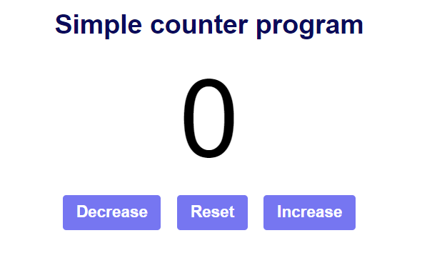

# Simple Counter Program

This is a simple web-based counter program that allows users to increment, decrement, and reset a counter.

## Preview



## How to Use

1. Clone this repository to your local machine:

   ```bash
   git clone <repository-url>

cd simple-counter-program


Open index.html in a web browser to view the counter program.

Click the "Decrease" button to decrement the counter.

Click the "Reset" button to reset the counter to zero.

Click the "Increase" button to increment the counter.

Technologies Used
HTML
CSS
JavaScript

