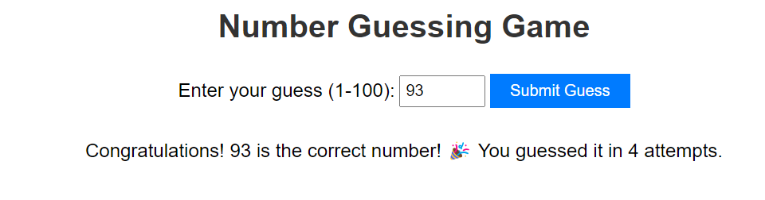

# Number Guessing Game

## Introduction
This is a simple number guessing game built using HTML, CSS, and JavaScript. The game generates a random number between 1 and 100, and the player needs to guess the correct number within a certain number of attempts.

## Features
- Generates a random number between 1 and 100.
- Allows the player to input their guess.
- Provides feedback on whether the guess is too high, too low, or correct.
- Displays the number of attempts left.
- Notifies the player when they guess the correct number.

## Technologies Used
- HTML
- CSS
- JavaScript

## How to Play
1. Open the game in a web browser.
2. Enter your guess in the input field.
3. Click the "Guess" button to submit your guess.
4. Receive feedback on whether your guess is too high, too low, or correct.
5. Keep guessing until you find the correct number or run out of attempts.

## Project Structure
- `index.html`: Contains the HTML structure of the game.
- `style.css`: Provides styles for the game interface.
- `script.js`: Implements the game logic and functionality.

## Preview

## Improvements
- Add sound effects for correct and incorrect guesses.
- Implement difficulty levels with different ranges of numbers.
- Include a timer for each guess to make the game more challenging.

Feel free to try out the game and provide any feedback or suggestions for improvement!
