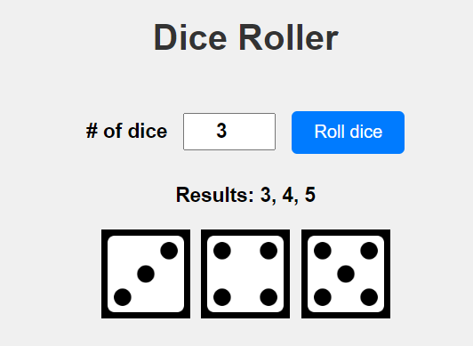

# Dice Roller

This is a simple web application that allows you to roll a specified number of dice.

## How to Use

1. Clone this repository to your local machine.
2. Open the `index.html` file in your web browser.
3. Enter the number of dice you want to roll.
4. Click the "Roll dice" button.
5. View the results of the dice roll.

## Technologies Used

- HTML
- CSS
- JavaScript

## Screenshots

## Credits

- Created by [Your Name]
- Dice images from [Your Source]

## License

This project is licensed under the [MIT License](LICENSE).
