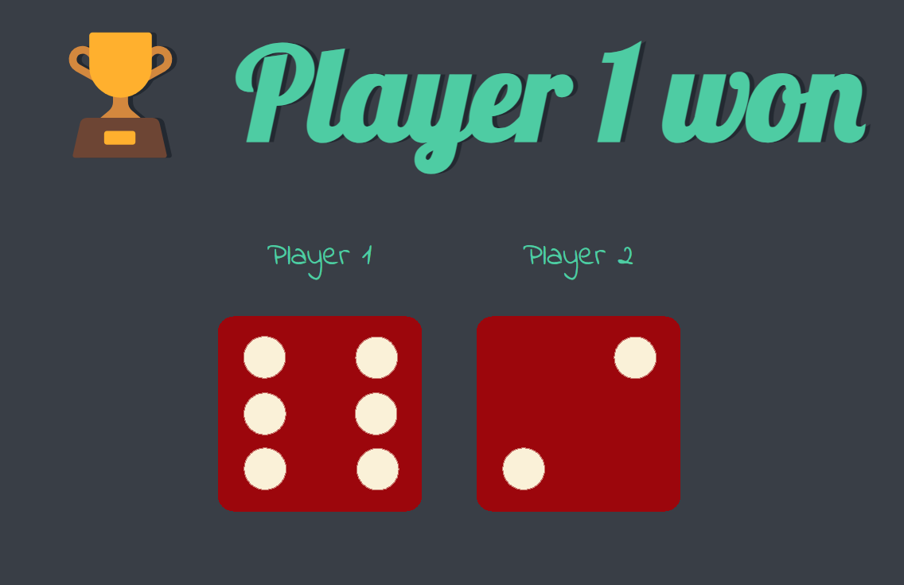
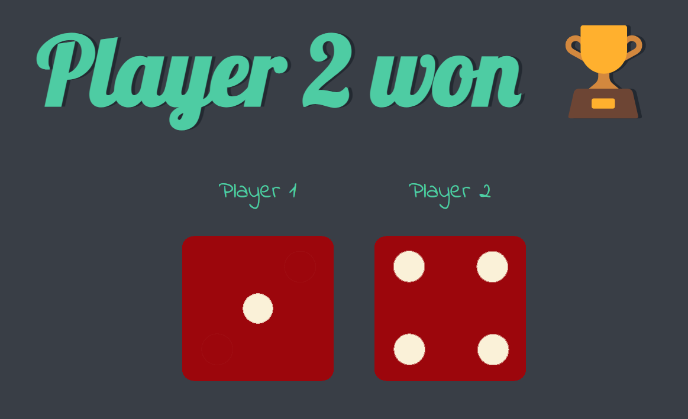
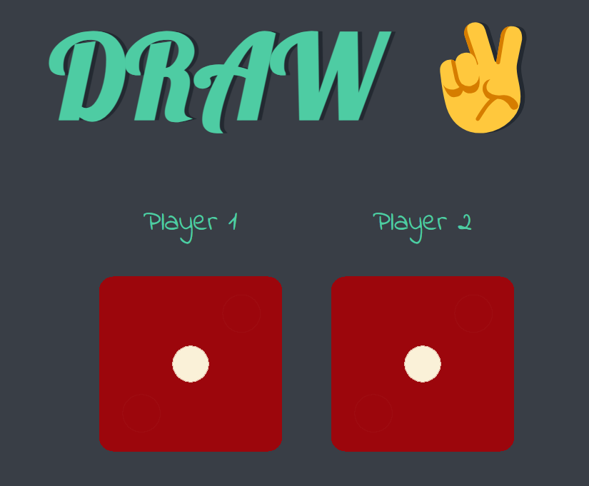

# Dicee

Dicee is a simple web application that simulates a dice game between two players. Each player's dice is rolled randomly, and the winner is determined based on the higher roll. 

## Preview

## How to Use

1. Clone this repository to your local machine.
2. Open the `index.html` file in your web browser.
3. Click on the "Refresh Me" button to roll the dice and see the results.
4. The winner of the game will be displayed below the dice images.

## Technologies Used

- HTML
- CSS
- JavaScript

## Project Structure

- `index.html`: Contains the structure and content of the web page.
- `styles.css`: Contains the styles for the web page.
- `index.js`: Contains the JavaScript code for rolling the dice and determining the winner.

## Credits

- Created by [Abhishek Kumar]