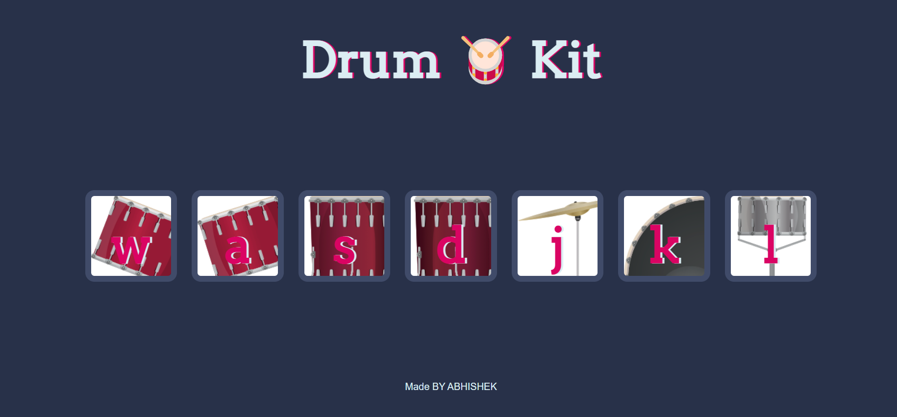

# Drum Kit

This is a simple drum kit web application that allows users to play drum sounds by clicking on buttons or pressing corresponding keys on the keyboard.

## Usage

To use the drum kit:
1. Click on the buttons with drum names (e.g., "w", "a", "s", "d", etc.) to play drum sounds.
2. Alternatively, you can press the corresponding keys on your keyboard to trigger the drum sounds.

## Screenshots



## Code Snippets

### HTML (index.html)

```html
<!DOCTYPE html>
<html lang="en">

<head>
  <meta charset="UTF-8">
  <title>Drum Kit</title>
  <link rel="stylesheet" href="styles.css">
</head>

<body>
  <!-- Drum buttons -->
  <div class="set">
    <button class="w drum">w</button>
    <button class="a drum">a</button>
    <!-- Add more buttons for other drum sounds -->
  </div>

  <script src="script.js"></script>
</body>

</html>
