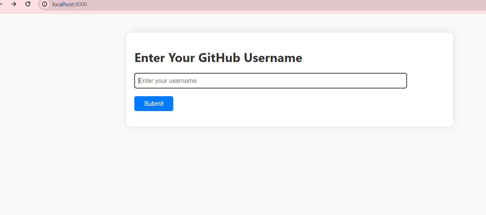
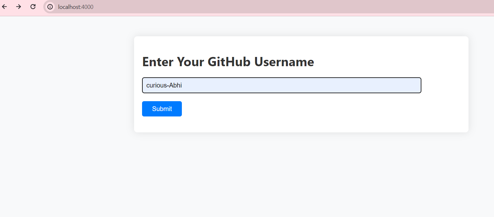
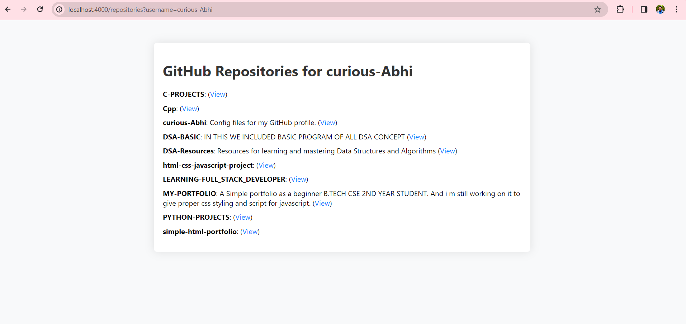

# GitHub API Project



This project is a simple web application built using Node.js, Express.js, Axios, and EJS. It interacts with the GitHub API to fetch and display a user's repositories in a user-friendly manner.

## Features

- Fetches a user's GitHub repositories using the GitHub API.
- Displays repository names, descriptions, and links to view each repository.

## Screenshots




## How to Use

1. Clone this repository to your local machine:

   ```bash
   git clone https://github.com/your-username/github-api-project.git

1.Install dependencies:
npm install
2.Run the server:
node index.js
3.Open your web browser and navigate to http://localhost:4000.

# Technologies Used
-Node.js
-Express.js
-Axios
-EJS

# Contributing

Pull requests are welcome. For major changes, please open an issue first to discuss what you would like to change.