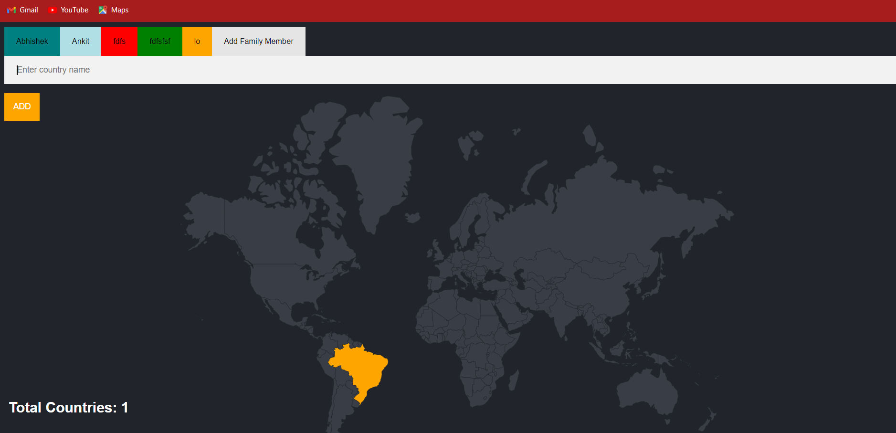
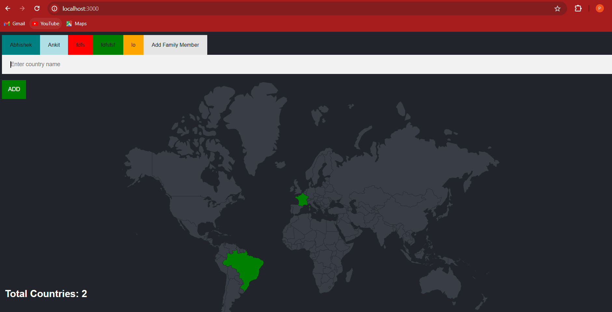
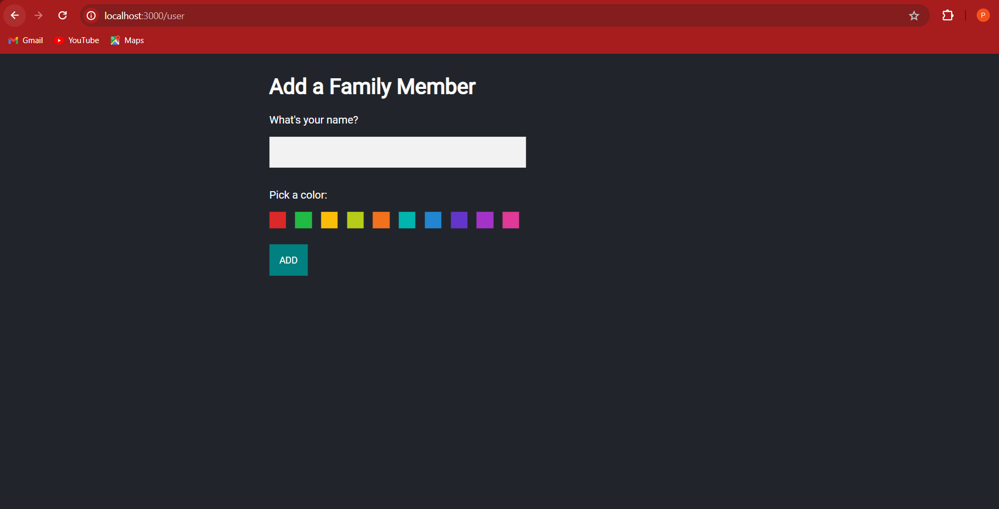

# Family Travel Tracker

Family Travel Tracker is a web application that allows families to track their travel destinations and adventures.

## Features

- **Add Visited Countries**: Users can add countries they have visited to their travel tracker.
- **Switch Users**: Family members can switch between users to view each other's visited countries.
- **Color-Coded Interface**: Each user has a unique color associated with their profile for easy identification.
- **Interactive Interface**: Users can interact with the application to add new countries and switch between family members seamlessly.

## Technologies Used

- **Express.js**: A web application framework for Node.js used to build the server-side logic.
- **PostgreSQL**: A powerful open-source relational database system used to store user data and visited countries.
- **EJS**: A simple templating language used to generate HTML markup with plain JavaScript.
- **HTML/CSS**: Used for the structure and styling of the front-end interface.
- **JavaScript**: Used for client-side scripting to enhance user interaction.

## Screenshot

## Installation

1. Clone the repository: `git clone <repository-url>`
2. Install dependencies: `npm install`
3. Set up the PostgreSQL database:
   - Create a new PostgreSQL database named `family_travel_tracker`.
   - Run the SQL script `schema.sql` provided in the repository to create the necessary tables.
4. Configure the database connection:
   - Update the database connection details in `server.js` to match your PostgreSQL database configuration.
5. Start the server: `npm start`
6. Open the application in your web browser: `http://localhost:3000`

## Usage

- Visit the homepage to view the list of visited countries for the default user.
- Use the "Add Country" form to add new countries to the travel tracker.
- Use the user switcher to switch between family members and view their visited countries.
- Capture screenshots of the travel tracker interface using the provided screenshot feature.
- Enjoy tracking your family's travel adventures!

## Contributing

Contributions are welcome! If you'd like to contribute to this project, please follow these steps:
1. Fork the repository.
2. Create a new branch for your feature: `git checkout -b feature-name`
3. Commit your changes: `git commit -am 'Add new feature'`
4. Push to the branch: `git push origin feature-name`
5. Submit a pull request.

## License

This project is licensed under the MIT License - see the [LICENSE](LICENSE) file for details.
