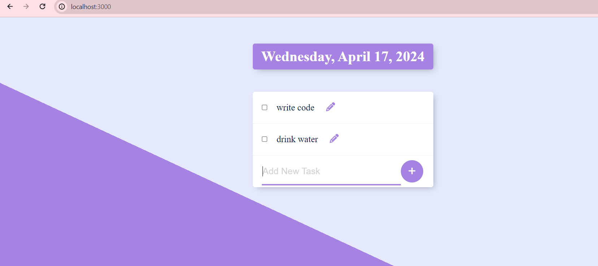

# Permalist

Permalist is a simple web application built with Node.js, Express, and PostgreSQL that allows users to create and manage a list of items with persistent storage.

## Features

- Add new items to your list.
- Edit existing items.
- Delete items from the list.
- User-friendly interface for easy interaction.

